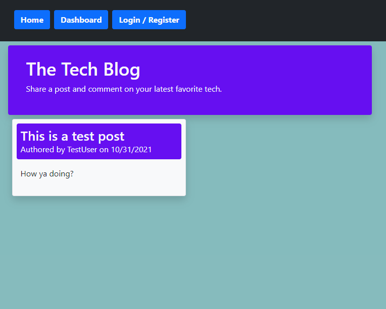
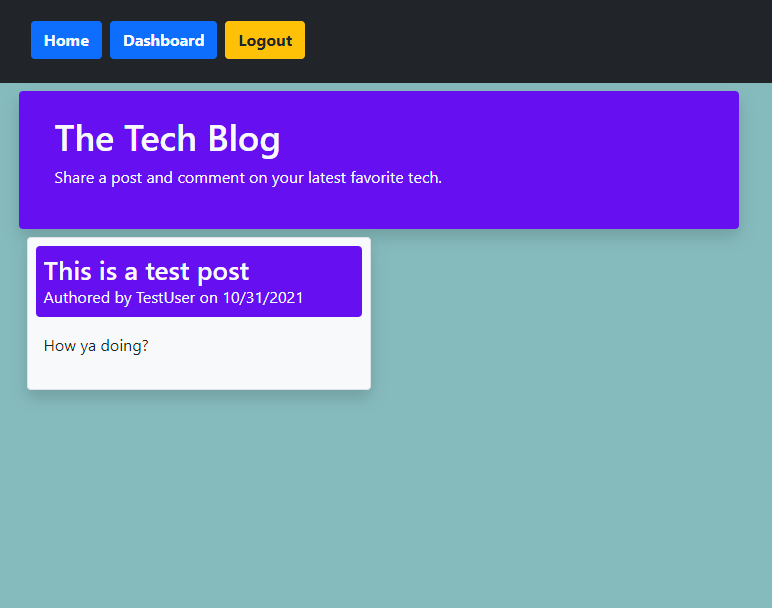
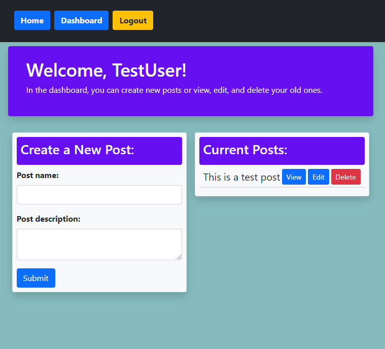

# tech-blog-mvc

## Description

A CMS-style blog site, where developers can publish their blog posts. This full-stack application follows MVC conventions in separating the user from the database, and the controller, and separating the view from the model.

The server is built on Express, and uses the Handlebars template engine (through express-handlebars), to render webpages (views) and send them to the user. The user can register and create their own account to post blogs and comment on individual posts. Bcrypt is used to hash user passwords, and express-sessions is used to create cookies to monitor user authorization. Morgan has been used as a logging middleware, and http-errors to serve errors when needed.

The database of this app is based on MySQL, and is accessed through Sequelize as an ORM. Sequelize makes it easy to build intuitive models and relationships in the database. In this app, there's the User model, the Post model (which belong to Users), and the Comments model(which belongs to both). The database is also holding the cookie references through the library connect-session-sequelize.

When the user visits the site, they are locked into the homepage and post pages, until they login and are authorized. After they login (or register), they may create new posts on their dashboard page, and comment on posts.

## Link to Demo

The site has been deployed to heroku.

[Link to demo deployment on heroku.](https://ghastly-ghoul-76054.herokuapp.com/)

## Screenshots

## Tech Stack

* JavaScript
* NodeJs
* Express
* Sequelize
* Dotenv
* Bootstrap CSS
